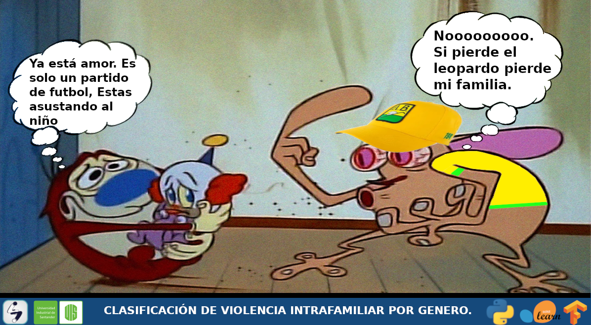

# Proyecto IA

## Clasificaion de violencia intrafamiliar por genero

#### Autores

Luigi Orlando Garcia Duarte

### Objetivo:

predecir por medio de factores como:
 
* Departamento
* Tipo de arma
* Grupo etario
* Cantidad

El genero de la victima.

### Dataset sin tratamiento de datos:

[Dataset](https://drive.google.com/file/d/1KLLTbfK7SFYkE_Rwbldl7xI--BRPgtpl/view?usp=sharing)

### Dataset con tratamiento de datos:

[Dataset](https://drive.google.com/file/d/1BUFH-9GiVz6JzoKeHPsbM3C6weYI2erB/view?usp=sharing)

### Metodos

* DesicionTreeClassificer
* RandomForestClassifier
* SVC

## Deep Learning DNN

* con 3 capas (hidden layer 1)
* con 5 capas (hidden layers 3)
* con 8 capas (hidden layers 6)

## Codigo 

[Codigo](https://github.com/LainLG/Proyecto_IA/blob/main/Proyecto.ipynb)
[Video](https://youtu.be/wReej7DeD9w)
[Repositorio](https://github.com/LainLG/Proyecto_IA/)
